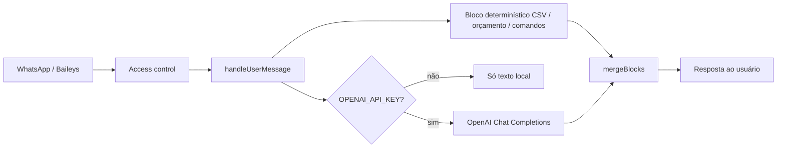

# Contexto do projeto (para IAs e evolução)

Este documento resume o **whatsapp-finance-agent** para que outra instância de IA (sem acesso ao repositório) consiga orientar evoluções: arquitetura atual, o que **não** está no código, e como encaixar ideias como LangChain, multi-modelo, multi-agente e controle de custo.

---

## O que é o projeto

- **Produto:** bot de **planejamento financeiro** no **WhatsApp**, em português do Brasil, via [Baileys](https://github.com/WhiskeySockets/Baileys) (`@whiskeysockets/baileys`).
- **Acesso:** apenas JIDs cujo número normalizado está em `ALLOWED_CONTACTS` (apenas dígitos).
- **Dados:** persistência por contato autorizado em `DATA_DIR/contacts/<id>/`, com histórico, faturas, artefatos e templates de contexto.
- **Dois modos de operação:**
  1. **Sem `OPENAI_API_KEY`:** respostas **só com lógica local** (classificação, totais, orçamento estimado, comandos `/…`).
  2. **Com chave OpenAI:** a mesma lógica local continua; o modelo **enriquece** a resposta com texto natural, mantendo o bloco numérico quando existir.

Não há dashboard web nem LangChain no estado atual da árvore de dependências.

---

## Stack relevante

| Camada                     | Tecnologia                                                                                                          |
| -------------------------- | ------------------------------------------------------------------------------------------------------------------- |
| Runtime                    | Node 20+ ou Bun                                                                                                     |
| WhatsApp                   | Baileys (sessão multi-arquivo em `SESSION_PATH`, padrão `.baileys_auth/`)                                           |
| LLM                        | SDK oficial `**openai`** (Chat Completions), **não** `@langchain/`*                                                 |
| Testes                     | Vitest                                                                                                              |
| “Skills” no sentido Cursor | Arquivos em `.cursor/skills/` (orientação para quem desenvolve; **não** são tools invocadas pelo modelo em runtime) |

---

## Arquitetura básica (como está hoje)

Fluxo resumido:

1. `src/index.ts` carrega env (`loadEnv`) e inicia `startWhatsAppBot`.
2. `src/whatsapp/client.ts` escuta `messages.upsert`, aplica controle de acesso, baixa mídia CSV se necessário, e chama `handleUserMessage` do agente.
3. `src/agent/finance-agent.ts` é o **cérebro da conversa**:
  - Comandos que começam com `/` são tratados de forma **determinística** (`/help`, `/status`, `/categorias`, `/orcamento`, `/limpar`).
  - Texto que parece CSV dispara **parse + categorização + agregação** (`src/finance/categorizer.ts`, `budget-planner.ts`) e grava faturas via `LocalStore`.
  - Antes de respostas analíticas, valida completude do contexto obrigatório do contato (perfil, comunicação, regras, ciclo e metas).
  - Todo CSV recebido gera artefatos bruto/parseados e resumo markdown por contato.
  - Se houver `OPENAI_API_KEY`, monta um histórico: **system** com prompt fixo + opcional **system** com “contexto calculado localmente” + últimas mensagens (até ~12) + mensagem atual, e chama o modelo.
4. `src/llm/provider.ts` — única integração LLM: `chat.completions.create` com `temperature`, `max_tokens`, timeout ~30s.

---

## “Skills pré-definidas” neste repositório

- **No código do bot:** não há **tool calling**, **function calling** nem agente com passos encadeados tipo LangChain Tools. O “comportamento especialista” vem do `**SYSTEM_PROMPT`** em `src/agent/finance-agent.ts` e das regras em código TypeScript (categorias, exclusão de pagamento de fatura/encargos do “consumo”, etc.).
- **No Cursor (desenvolvimento):** pastas `.cursor/skills/` — por exemplo `financial-planner-whatsapp` e `baileys-whatsapp-agent` — guiam **humanos e IAs no IDE**, não o modelo em produção.

Para um assistente que “tenha skills” de verdade no runtime, seria necessário evoluir para **tools** (OpenAI), **LangChain/LangGraph**, ou orquestração customizada.

---

## Parâmetros que já limitam custo / uso do modelo

Em `src/llm/provider.ts` (valores atuais):

- `**max_tokens: 1800`** — teto de saída por chamada.
- `**temperature: 0.4**` — respostas mais estáveis, menos “divagação”.
- `**AbortSignal.timeout(30_000)**` — evita chamadas penduradas (não é limite de $).
- Histórico truncado: últimas **12** mensagens do usuário/assistente antes da atual (`finance-agent.ts`).

Não existe hoje: orçamento em **USD por dia**, contador de tokens por usuário, modelo barato para triagem vs modelo caro para resposta final, nem cache semântico.

---

## LangChain e multi-modelo

- **Estado atual:** uma única chamada síncrona ao modelo configurado em `OPENAI_MODEL` (padrão `gpt-4o-mini` em `src/config/env.ts`). Sem LangChain.
- **LangChain / LangGraph** podem ser usados **depois** para:
  - encadear passos (roteamento, revisão, sumarização);
  - **multi-modelo** (ex.: um modelo classifica intenção barato, outro redige);
  - **supervisor** que decide qual subfluxo rodar.

Isso **não** é obrigatório: o mesmo pode ser feito com **código TypeScript + várias chamadas `chat.completions`** ou **Responses API** / assistentes, conforme política de custo e complexidade desejada.

---

## Multi-agente com coordenador central

**No código hoje:** um único “agente” lógico (`handleUserMessage`) — não há agentes paralelos.

**Evolução conceitual (alinhada ao domínio financeiro):**

| Papel (exemplo)         | Função                                                                                             |
| ----------------------- | -------------------------------------------------------------------------------------------------- |
| **Orquestrador**        | Classifica intenção (dúvida, CSV, orçamento, off-topic), limita ferramentas e orçamento de tokens. |
| **Analista numérico**   | Só lógica local (já existe em TS; pode ser exposto como “agente” que não chama LLM).               |
| **Redator**             | LLM que só recebe fatos já calculados e estilo do `SYSTEM_PROMPT`.                                 |
| **(Opcional) Pesquisa** | Só se no futuro houver RAG ou APIs externas.                                                       |

Padrões comuns: **supervisor** (LangGraph), **hierárquico**, ou **handoff** explícito no prompt. O coordenador pode ser **código** (if/else + limites) sem framework.

---

## Diferença: arquitetura básica vs. o que dá para fazer

| Aspecto      | Hoje (básico)                             | Possível evolução                                                        |
| ------------ | ----------------------------------------- | ------------------------------------------------------------------------ |
| Orquestração | Um fluxo linear + um System prompt        | Roteamento por intenção, filas, grafo de estados                         |
| LLM          | Um modelo, uma chamada por mensagem       | Vários modelos ou várias etapas com política de custo                    |
| Ferramentas  | Nenhuma tool registrada no modelo         | Tools: “recalcular orçamento”, “listar faturas”, etc.                    |
| Memória      | JSON por chat, janela curta para o modelo | Resumo longo, episódico, vector store                                    |
| Custo        | `max_tokens` + histórico curto            | Budget por usuário/dia, tokenizer explícito, modelo mini só para triagem |

---

## Variáveis de ambiente (relevantes para IA e custo)

- `OPENAI_API_KEY` — ausente = modo só local.
- `OPENAI_MODEL` — padrão `gpt-4o-mini`.
- `ALLOWED_CONTACTS`, `DATA_DIR`, `SESSION_PATH`, `REPLY_TO_DENIED`, `DENIED_MESSAGE`, `PRINT_QR_TERMINAL` — ver `src/config/env.ts` e `README.md`.

---

## Arquivos-chave para não alucinar caminhos

| Arquivo                                           | Papel                                            |
| ------------------------------------------------- | ------------------------------------------------ |
| `src/agent/finance-agent.ts`                      | Prompt, comandos, merge determinístico + LLM     |
| `src/llm/provider.ts`                             | Chamada OpenAI e limites (`max_tokens`, timeout) |
| `src/config/env.ts`                               | Modelo e paths                                   |
| `src/whatsapp/client.ts`                          | Baileys, eventos, encaminhamento ao agente       |
| `src/storage/store.ts`                            | Persistência por contato + templates + artefatos |
| `src/finance/categorizer.ts`, `budget-planner.ts` | Regras de negócio numéricas                      |
| `.cursor/skills/*/SKILL.md`                       | Convenções de produto para desenvolvimento       |

---

## Perguntas frequentes de evolução (respostas curtas)

**“Como funciona LangChain em processos multi-modelo?”**  
LangChain (e principalmente **LangGraph**) modela grafos de nós: cada nó pode chamar um modelo ou ferramenta diferente. Não é mágica de multi-modelo: você define **qual modelo** em cada nó e **quem passa o estado** adiante. Este projeto ainda não usa LangChain; a ideia se aplica como biblioteca de orquestração, não como requisito.

**“Meu projeto usa GPT com skills pré-definidas — como multi-agente com central?”**  
Aqui “skills” = prompt + regras TS. Um coordenador pode ser: (1) **código** que decide o próximo passo, ou (2) **LLM supervisor** com saída estruturada (JSON) listando o próximo agente e o orçamento de tokens. LangChain facilita o grafo; **não** substitui desenhar políticas de custo e limites.

**“LangChain seria para isso?”**  
Pode ser **uma** opção para orquestrar agentes e tools. Alternativa: **TypeScript puro** + várias funções + OpenAI API. A escolha é engenharia (manutenção, time, observabilidade), não correção única.

**“Como definir limite de gastos por iteração?”**  
Camadas típicas: (1) **por chamada:** `max_tokens`, modelo mais barato na triagem; (2) **por conversa:** somar `usage` da API (prompt + completion tokens) e cortar quando ultrapassar teto; (3) **por tempo:** rate limit. Este repo só implementa (1) parcialmente via `max_tokens` e janela de histórico.

**“Diferença da arquitetura básica para o que dá para fazer?”**  
Ver tabela acima: hoje é **pipeline único** (local + opcional um shot de LLM). Evoluções naturais são **supervisor**, **tools**, **multi-modelo por etapa** e **métricas de uso** — todas compatíveis com ou sem LangChain.

---

## Manutenção deste documento

Ao mudar o fluxo do agente, o provedor LLM ou as variáveis de ambiente, atualize as seções **Arquitetura**, **Parâmetros** e **Arquivos-chave** para este arquivo continuar útil para IAs externas.